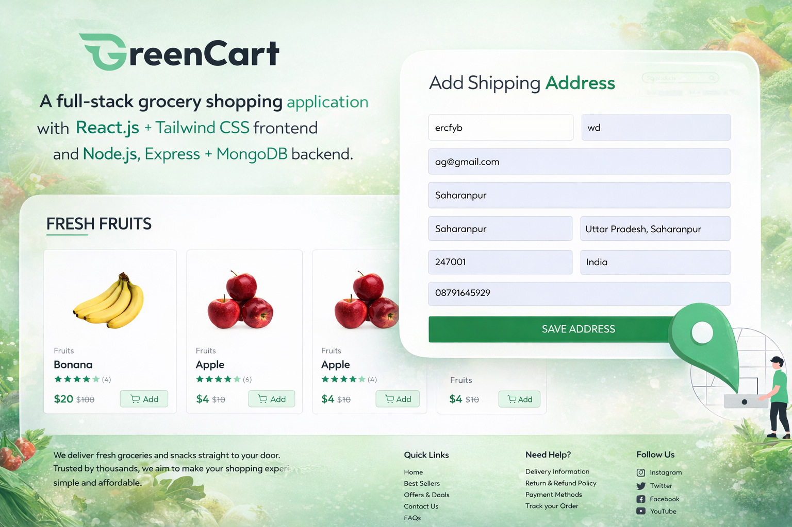

<p align="center">
  <h1 align="center">🛒 Grocery App</h1>
  <p align="center">
    A full-stack grocery shopping application built with <b>React.js & Tailwind CSS</b> on the frontend and <b>Node.js, Express & MongoDB</b> on the backend, featuring cart management, secure checkout (COD & Stripe), and admin product controls.
  </p>
</p>
<p align="center">
  
</p>

---

## ⚙️ Tech Stack

```text
Frontend: React.js, Tailwind CSS, React Router, Context API
Backend: Node.js, Express.js, MongoDB (Mongoose), JWT Authentication, Multer + Cloudinary, Stripe payments

🚀 Features

- User & Seller authentication
- Product management (add, list, update stock)
- Cart management
- Place orders (COD & Stripe payments)
- Order tracking
- Address management
- Admin Panel

📂 Project Structure

frontend/        # React + Tailwind
backend/         # Node.js + Express + MongoDB

📌 API Routes

# User
POST /api/user/register
POST /api/user/login
POST /api/user/logout

# Seller
POST /api/seller/register
POST /api/seller/login

# Product
POST /api/product/add
POST /api/product/list
POST /api/product/id
POST /api/product/stock

# Cart
POST /api/cart/add
POST /api/cart/remove

# Order
POST /api/order/cod
POST /api/order/stripe
GET /api/order/user
GET /api/order/seller

# Address
POST /api/address/add
GET /api/address/list

💻 Setup

# Frontend
cd frontend
npm install
npm start

# Backend
cd backend
npm install
npm run dev

📝 Environment Variables (.env)

PORT=5000
MONGO_URI=your_mongo_connection_string
JWT_SECRET=your_jwt_secret
STRIPE_SECRET_KEY=your_stripe_secret_key
STRIPE_WEBHOOK_SECRET=your_stripe_webhook_secret
CLOUDINARY_CLOUD_NAME=your_cloud_name
CLOUDINARY_API_KEY=your_api_key
CLOUDINARY_API_SECRET=your_api_secret

🔹 Notes

- Stripe webhooks are required to update online payments (isPaid)
- Admin routes are JWT protected
- Frontend uses Context API for global state


